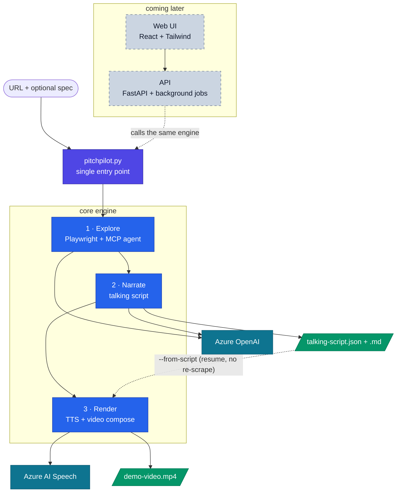

# PitchPilot

> **Autopilot for product demos — point it at any app, get a narrated walkthrough.**

**PitchPilot turns any web application into a polished, narrated demo video.** It
autonomously explores the live app, understands its functional flow, writes a
presenter-quality script in the product's own language, and narrates it with Azure
AI Speech over the captured screens — collapsing hours of demo prep into minutes.

## Why it matters

**The problem:** Great software often demos poorly. Whoever has to present an app —
an account manager, a founder, a support lead — frequently lacks the domain
knowledge to walk through it convincingly, so the demo undersells the build.

**PitchPilot is autopilot for product demos.** Point it at any web app (URL +
optional spec) and it:

1. **Explores** the live interface autonomously via an agent (Playwright + MCP),
   capturing every key screen.
2. **Understands** the functional flow, internalising any specification so it
   speaks in the customer's terminology — not generic filler.
3. **Scripts** a presenter-grade walkthrough that any non-expert can confidently
   deliver.
4. **Produces** a narrated video with Azure AI Text-to-Speech, motion, transitions,
   and music.

The result is a ready-to-share artifact that makes demo quality **consistent
regardless of who's in the room** — and it scales to any app, any domain, any
language.

## What makes it stand out

- **Impact** — Removes a universal bottleneck: *"can you walk us through the app?"*
  Every team that ships software needs this, and consistent demos protect the value
  of what was built.
- **Innovation** — Not another screen recorder. PitchPilot is an **agent that
  comprehends an unfamiliar app** and generates domain-accurate narration —
  understanding, not just capture.
- **Technical depth** — A multi-stage agentic pipeline: autonomous exploration
  (MCP + Playwright) → functional-flow reasoning (LLM) → script generation → speech
  synthesis → automated video composition. A real, working end-to-end system.
- **Scalability** — App- and domain-agnostic by design. One pipeline serves sales
  enablement, onboarding, release notes, support, accessibility, and localisation
  (multilingual voices built in).
- **Azure-native** — Built on Azure OpenAI + Azure AI Speech, with a clean
  enterprise-adoption and cost-control story.

> *"Every company can build impressive software. Almost none can demo it
> consistently. PitchPilot puts every product demo on autopilot — any app, any
> language, in minutes."*
>
> - *"Screen recorders capture what you do. PitchPilot understands what the app is."*
> - *"Hours of a domain expert's time → a 2-minute video, automatically."*
> - *"One pipeline, any web app, any domain, any language."*

## How it works



## One entry point, flag-driven

Everything runs through `pitchpilot.py`:

```powershell
# Stages 1 + 2: explore the app and write the talking transcript
python pitchpilot.py

# Stages 1 + 2 + 3: also render the narrated MP4
python pitchpilot.py --video

# Stage 3 only: render the video from an existing transcript (no re-scrape, no LLM)
python pitchpilot.py --from-script "output\<app-slug>\<timestamp>\talking-script.json" --video

# Silent preview (skips billable Text-to-Speech)
python pitchpilot.py --video --dry-run
```

| Flag | Effect |
| --- | --- |
| _(none)_ | Explore the app, then write `talking-script.json` / `.md`. Stops there. |
| `--video` | Also synthesize narration and compose `demo-video.mp4`. |
| `--from-script PATH` | Skip scraping + narration; render the video straight from an existing `talking-script.json`. |
| `--dry-run` | Compose a silent preview without calling Azure Text-to-Speech. |
| `--format md\|html` | Output format for the presenter demo script (default `md`). |

The transcript-only run prints the exact `--from-script` command to make the
video later, so you never re-run the whole pipeline just to render.

## Pipeline

1. **Explore** — Playwright MCP + an Azure OpenAI agent log in, walk the app, and
   write `demo-script.md` + one screenshot per feature.
2. **Narrate** — Azure OpenAI rewrites the presenter notes into an organic spoken
   script (`talking-script.json` + a readable `talking-script.md`).
3. **Render** — Azure Text-to-Speech voices each segment; MoviePy composites the
   narration over the screenshots (Ken Burns, crossfades, optional music) into
   `demo-video.mp4`.

Every artifact for a run lands in one folder:

```
output/<app-slug>/<timestamp>/
    demo-script.md          # presenter script
    demo-script.html        # polished HTML (when --format html)
    screenshots/            # one image per feature page
    talking-script.json     # machine-readable narration (drives synthesis)
    talking-script.md       # human-readable review copy
    clips/segment_XXX.mp3    # per-segment narration audio (skipped on --dry-run)
    demo-video.mp4          # final video (with --video)
output/<app-slug>/latest.html   # standalone shareable script (screenshots embedded)
```

## Setup

```powershell
python -m venv .venv
.\.venv\Scripts\Activate.ps1
pip install -r requirements.txt
Copy-Item .env.template .env    # then fill in Azure OpenAI + Speech values
```

Requires **Node.js** on `PATH` (`npx` launches the Playwright + filesystem MCP
servers) and **Python 3.11–3.13**. ffmpeg is provided by the bundled
`imageio-ffmpeg`, so no separate install is needed.

## Layout

```
pitchpilot.py     # single entry point (flags above)
core/             # the engine — explorer, narration, TTS, compositor
assets/music/     # optional royalty-free background music
api/              # (reserved) FastAPI + background jobs — added later
web/              # (reserved) React + Tailwind UI — added later
```

`api/` and `web/` are intentionally empty scaffolding for the upcoming API and
web layers, which will call the `core/` engine.
