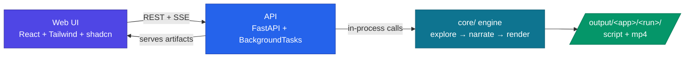

# PitchPilot — API + Web UI Build Brief

> **For the collaborator:** open this repo in VS Code with GitHub Copilot (agent
> mode) and hand it this file. It's a self-contained spec to build the **API** and
> **Web UI** on top of the existing `core/` engine. Build the API first, then the UI.

## How to use this doc with Copilot

1. **Load the Karpathy skill first.** Start your Copilot session with:
   *"Read and follow the `karpathy-guidelines` skill for this whole task."*
   It keeps the work simple, surgical, and free of over-engineering.
2. Work in phases (below). After each phase, verify the acceptance checks before
   moving on.
3. **Do not modify `core/`** except the one small optional seam noted in Phase 1.
   The engine already works end-to-end — build around it, don't rewrite it.

## Ground rules (keep it simple — do NOT over-engineer)

- **No** database, auth, user accounts, Docker, Redis/Celery, or a test framework.
- **No** speculative features, config knobs, or abstractions that weren't asked for.
- Single-user, local-dev only. One run at a time is fine.
- Every file you add lives under `api/` or `web/`. Nothing else changes.
- Match the existing project's plain, direct style.

---

## What already exists (the engine)

`core/` is a working 3-stage pipeline. The CLI [`pitchpilot.py`](../pitchpilot.py)
already orchestrates it — **your API worker should mirror that same flow**, just
without the interactive prompts.

| Stage | Call | Produces |
| --- | --- | --- |
| 1 · Explore | `await core.explorer.explore(config, base_url, password, spec_text)` → `(run_dir, app_slug, script_path)` | `demo-script.md` + `screenshots/` |
| 2 · Narrate | `core.input_parser.parse_input(script_path)` → parsed; `core.script_generator.generate_talking_script(config, parsed)` → script; `core.script_generator.save_talking_script(script, run_dir)` | `talking-script.json` / `.md` |
| 3 · Render | `core.video.render_video(config, script["segments"], run_dir, app_slug, dry_run)` | `demo-video.mp4` (+ `clips/`) |

- `config = core.config.Config.load()` reads the root `.env` (Azure OpenAI + Speech).
- Resume/video-only path exists too: `core.video.render_from_script(config, json_path, dry_run)`.
- All artifacts for a run land in `output/<app-slug>/<timestamp>/`.

> **Runtime note:** Stage 1 launches a **real Chromium window** via Playwright MCP
> and needs **Node.js** on PATH. Run the API on a desktop session (not a headless
> server). Stage 3 needs the Azure Speech keys unless `dry_run=True`.

### Architecture



---

## Phase 1 — API (FastAPI + BackgroundTasks)

Everything under `api/`. Delete the placeholder `api/README.md` once real code lands.

### Stack
- `fastapi`, `uvicorn[standard]`, `pydantic`, `sse-starlette` (for SSE), `python-multipart`.
- Add an `api/requirements.txt` for these. The engine deps come from the root
  `requirements.txt` (install both).

### Job model (in-memory)
- A module-level `dict[str, Job]` keyed by a generated `job_id` (uuid4).
- `Job` fields: `id`, `status`, `stage`, `make_video`, `dry_run`, `run_dir`,
  `app_slug`, `artifacts` (dict of names→paths), `error`, and an
  `asyncio.Queue` of progress events for SSE.
- `stage` progresses: `queued → exploring → narrating → rendering → completed`
  (or `failed`). For transcript-only runs, skip `rendering` and go to `completed`
  after `narrating`.
- Jobs are lost on restart — that's acceptable (documented, no persistence).

### Endpoints
| Method + path | Purpose |
| --- | --- |
| `POST /api/jobs` | Start a run. Body: `{ base_url, password, spec_text, make_video: bool, dry_run?: bool, format?: "md" \| "html" }`. Creates a Job, schedules the worker via `BackgroundTasks`, returns `{ job_id }`. |
| `GET /api/jobs/{id}` | Current job snapshot (status, stage, artifacts, error). |
| `GET /api/jobs/{id}/events` | **SSE stream** (`sse-starlette`) emitting each stage transition + a final `done`/`error` event. Close the stream when the job settles. |
| `GET /api/jobs/{id}/script` | Return `talking-script.md` text (for the UI to render). |
| `GET /api/jobs/{id}/video` | Stream/download `demo-video.mp4` (`FileResponse`). |
| `GET /api/jobs/{id}/screenshots/{name}` | Serve a screenshot (optional gallery). |

### Worker (mirror `pitchpilot.py`, no prompts)
```
1. status=exploring  → run_dir, app_slug, script_path = await explore(config, ...)
   push event; if script missing → fail.
2. status=narrating  → parse_input → generate_talking_script → save_talking_script
   record artifacts (script json/md); push event.
3. if make_video: status=rendering → render_video(...); record mp4 artifact; push event.
4. status=completed  → push done event.
Wrap in try/except → status=failed, error=str(e), push error event.
```
Call `Config.load()` once at startup; reuse it. Validate required env with the
existing `config.missing_for_script()` / `missing_for_narration()` helpers and
return a clear 400 if keys are missing.

### CORS
Enable CORS for the Vite dev origin (`http://localhost:5173`).

### Acceptance checks (Phase 1)
- `POST /api/jobs` returns a `job_id` immediately; the run proceeds in the background.
- `GET /api/jobs/{id}/events` streams stage transitions live until `completed`/`failed`.
- After completion, `/script` returns the transcript and (if `make_video`) `/video`
  streams a playable MP4.
- Errors (bad URL, missing env) surface as a `failed` job with a readable message.

---

## Phase 2 — Web UI (React + Tailwind + shadcn/ui)

Everything under `web/`. Delete the placeholder `web/README.md` once real code lands.

### Stack & setup
- **Vite + React + TypeScript + Tailwind (v4) + shadcn/ui.**
- Follow the official shadcn Vite guide — quickest path is
  `npx shadcn@latest init -t vite` (uses the `@tailwindcss/vite` plugin and sets
  up the `@/*` alias). Docs: <https://ui.shadcn.com/docs/installation/vite>.
- Add only the shadcn components you use: `button`, `input`, `textarea`, `label`,
  `card`, `tabs`, `badge`, `switch`, `sonner` (toasts), `skeleton`.
- API base URL from `VITE_API_BASE` (default `http://localhost:8000`).
- Keep it to ~3 views. Simple client-side routing (or even conditional render) is
  fine — don't pull in heavy state libraries.

### Visual identity — polished, professional, PitchPilot-branded
- **Palette:** neutral **slate** surfaces with an **indigo** (`#4f46e5`) primary
  accent; a teal (`#0e7490`) secondary for "Azure/processing" hints; emerald for
  success, rose for errors. Set these as the shadcn theme tokens.
- **Type:** Inter (or system UI). Clear hierarchy, generous line-height.
- **Feel:** minimal and confident — lots of whitespace, `rounded-2xl` cards, soft
  shadows, subtle borders, smooth micro-transitions. Full **light + dark** support
  via shadcn's theming. Fully responsive; accessible (labels, focus states, aria).
- A slim top bar with the **PitchPilot** wordmark + tagline
  *"Autopilot for product demos."*
- This is judge-facing — it should look like a real product, not a form dump.

### Screens
1. **New Run** — a centered card with:
   - App URL (`input`, required, URL validation).
   - Admin password (`input type=password`).
   - Spec document (`textarea`; optionally a file picker that reads `.md`/`.txt`
     into the textarea).
   - A segmented toggle / `switch`: **Transcript only** vs **Transcript + Video**.
   - Optional **Dry run** switch (silent preview, no TTS cost) — show only when
     video is selected.
   - Primary **Generate** button → `POST /api/jobs`, then navigate to Progress.
2. **Run Progress** — a **stepper** (Explore → Narrate → Render) driven by the SSE
   stream: active step animated, done steps checked, failed step in rose with the
   error message. Show a tasteful loading state; disable navigation away mid-run
   with a toast if needed. Auto-advance to Result on `completed`.
3. **Result** — a card with **Tabs**:
   - **Transcript** — render `talking-script.md` (use a lightweight markdown
     renderer) in a readable, styled prose block.
   - **Video** — an HTML5 `<video>` player for `/video` + a Download button
     (only when a video was generated).
   - *(optional)* **Screens** — a small screenshot gallery.

### API client
- One tiny `lib/api.ts`: `createJob(payload)`, `getJob(id)`, `getScriptText(id)`,
  `videoUrl(id)`, and an `EventSource` helper for `/events`.
- Handle the SSE `done`/`error` events to flip UI state; show `sonner` toasts on
  failures.

### Acceptance checks (Phase 2)
- Submitting the form starts a job and the stepper reflects **live** progress via SSE.
- Transcript-only runs land on the Result → Transcript tab with readable content.
- Video runs show a **playable** MP4 and a working download.
- Looks polished in both light and dark, and on a phone-width viewport.
- `npm run build` passes with no type errors.

---

## Run it (dev)

```powershell
# 1. Engine env (once) — from repo root
Copy-Item .env.template .env   # fill Azure OpenAI + Speech keys
pip install -r requirements.txt -r api/requirements.txt

# 2. API (desktop session, Node.js on PATH)
uvicorn api.main:app --reload --port 8000

# 3. Web (separate terminal)
cd web
npm install
npm run dev            # http://localhost:5173  (set VITE_API_BASE if API isn't :8000)
```

## Definition of done
- One command starts the API, one starts the UI.
- A user can submit a run in the browser, watch it progress live, and get a
  readable transcript and (optionally) a playable video — all without touching the
  terminal or the engine directly.
- `core/` is unchanged in behavior; the app is simple, readable, and on-brand.

## Explicitly out of scope (don't build these)
Auth · databases · multi-user · job persistence across restarts · queues/workers
beyond BackgroundTasks · Docker/CI · unit-test suites · analytics · i18n · any
refactor of `core/`.
